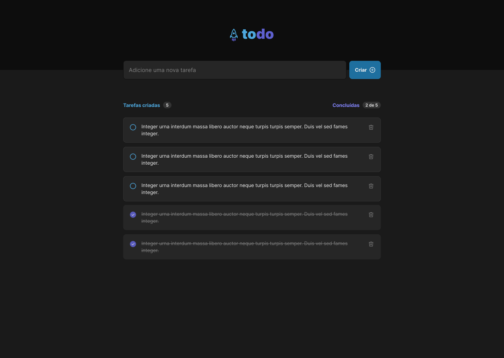

<h1 align="center"> ToDo List</h1>

  <a href="#-tecnologias">Tecnologias</a>&nbsp;&nbsp;&nbsp;|&nbsp;&nbsp;&nbsp;
  <a href="#-projeto">Projeto</a>&nbsp;&nbsp;&nbsp;|&nbsp;&nbsp;&nbsp;
  <a href="#-layout">Layout</a>&nbsp;&nbsp;&nbsp;|&nbsp;&nbsp;&nbsp;
  <a href="#memo-licença">Licença</a>

  

 

  

## 🚀 Tecnologias

Esse projeto foi desenvolvido com as seguintes tecnologias:

- HTML e CSS
- JavaScript
- Reactjs
- Type Script
- Git e Github
- Figma

## 💻 Projeto

ToDo List é uma lista de tarefas em que o usuário pode adicionar e remover tarefas além de poder marcar as tarefas concluídas.

## 🔖 Layout

Você pode visualizar o layout do projeto através [DESSE LINK](https://www.figma.com/file/OPIStOLHszfrTGZ1i9mayj/ToDo-List-%E2%80%A2-Desafio-React-(Copy)?node-id=0%3A1&mode=dev.) É necessário ter conta no [Figma](https://figma.com) para acessá-lo.

## :memo: Licença

Esse projeto está sob a licença MIT.

---

Feito a partir das aulas da Rocketseat [Ignit aulas](https://app.rocketseat.com.br/ignite)